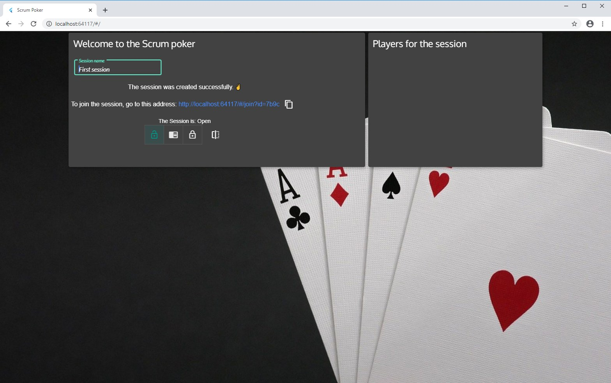
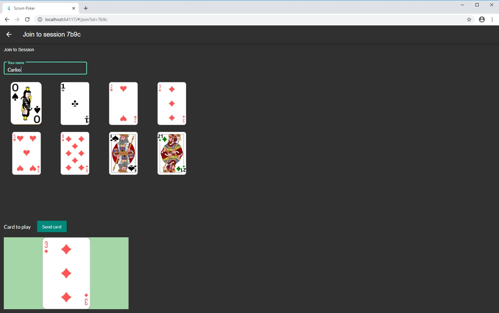
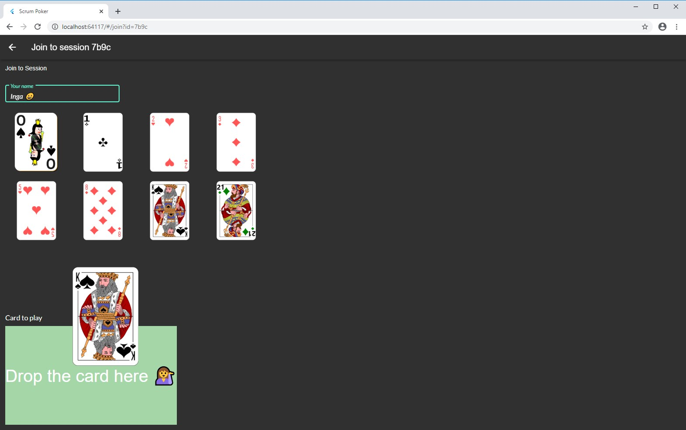
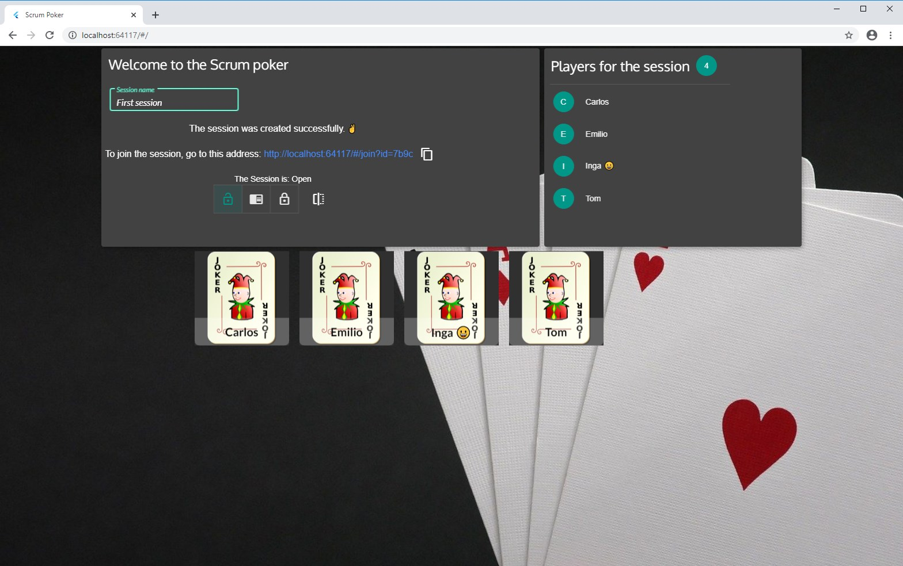
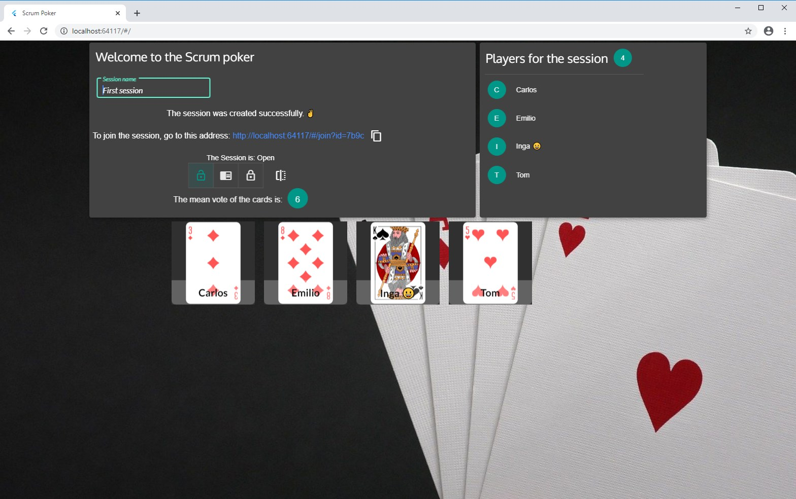

# scrumpoker
Poker planning implementation, using Flutter for the client and Deno as the backend.

Communication between the client and the server will be done using Websockets.

## Screenshots
### Session creation

<table><tr>
  <td style="text-align: center">
  
</td>
<tr></table>

### Members vote

<table><tr>
<td style="text-align: center">
 
</td>
<td style="text-align: center">
  
</td>
<tr></table>

### Receipts of votes and disclosure of cards elected by members

<table><tr>
<td style="text-align: center">
 
</td>
<td style="text-align: center">
  
</td>
<tr></table>

## Requirements:
- Have Flutter for Web 😉 installed more in https://flutter.dev/docs/get-started/web
- Install Deno from https://deno.land/#installation

## Disclaimer
- I'm not a Flutter expert.
- Flutter for Web is currently in beta.
- I'm not an expert in Deno.

The objective is "Learning by doing" and the desire to face new challenges.

Everyone can contribute to the project.

***Images used in the project come from the portal https://pixabay.com***

All in the form of use **Pixabay Royalty free commercial use.
No picture credits required**.
